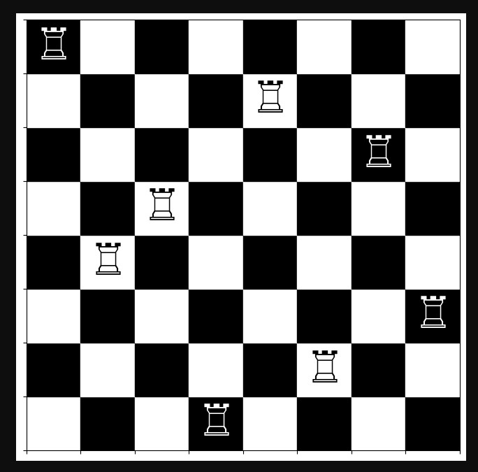

# Proiect Map 23 : "Problema celor 8 turnuri"

## Aceasta problema are ca cerinta pozitionarea aleatoare a 8 turnuri pe tabla de sah,fara ca acestea sa se atace reciproc

"Problema celor 8 turnuri" este o problema clasica de programare. Am ales sa folosesc limbajul Python pentru implementarea rezolvarii
acestei probleme,deoarece,prin prezenta modulelor,mi-a facilitat o gama larga de solutii,atat pentru partea vizuala,cat si pentru partea
de server al programului.

Programul are in spate imginea Docker "python:latest".

## Repository-ul contine urmatoarele fisiere:

* Fisierul "main.py" ce contine codul sursa
* Un fisier de tip "Dockerfile" pentru a putea accesa imaginea Python
* Un fisier de tip .yml pentru automatizarea programului prin construirea si publicarea imaginii in package
* Fisierul "README.md" pentru documentatia proiectului

## Instalare & Rulare

1. Instalarea package-ului **proiectmap** prin comanda : docker pull ghcr.io/stanremus15/proiectmap:latest;
2. Rularea imaginii cu comanda : docker run -d -p 8080:8000 ghcr.io/stanremus15/proiectmap:latest;
3. Pentru a verifica rezultatele se va accesa linkul : http://localhost:8080/tabla_sah.png;

## Modul de functionare al problemei

Acest cod creeaza un server HTTP simplu ce genereaza si serveste o imagine a unei table de sah.
Codul este impartit in mai multe parti:

### Generarea tablei de sah

Functia **generare_turnuri(n)** creeaza tabla de sah de n x n,folosind o matrice bidimensionala.
Dupa aceea pozitioneaza turnuri pe tabla astfel incat sa nu se gaseasca doua turnuri pe aceeasi coloana.

Functia **formare_tabla_sah(tabla)** se foloseste de matplotlib pentru a desena tabla si pozitiile.
Tabla este impartita in patrate ce urmeaza sa se coloreze in negru sau alb
Imaginea este salvata intr-un buffer in memorie(BytesIO),pentru a putea sa fie transmisa direct in raspunsul HTTP

### Gestionarea cererilor HTTP

Clasa **RequestHandler** extinde functionalitatea serverului HTTP implicit pentru a raspunde cererilor catre URL-ul specific.
Metoda **do_GET(self)** genereaza si creeaza imaginea si apoi trimite un raspuns HTTP pentru a transmite imaginea generata ca un fisier PNG

### Crearea si rularea serverului

Serverul este creat pe portul definit in PORT.

## Solutia

O reprezentare vizuala a unei solutii random este urmatoarea:

 

Aceasta solutie se va schimba de fiecare data cand utilizatorul va da refresh paginii.

## Bibliografie

* Learn Python : https://www.learnpython.org/
* W3Schools :  https://www.w3schools.com/python/matplotlib_intro.asp
* Documentatie Python oficiala : https://docs.python.org/3/